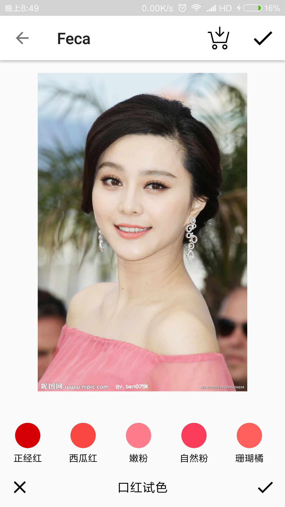
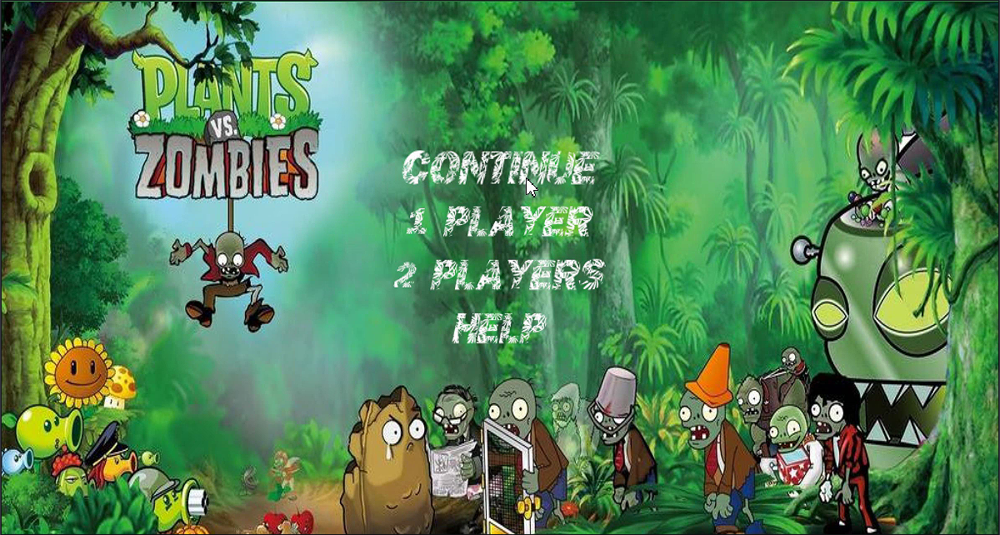
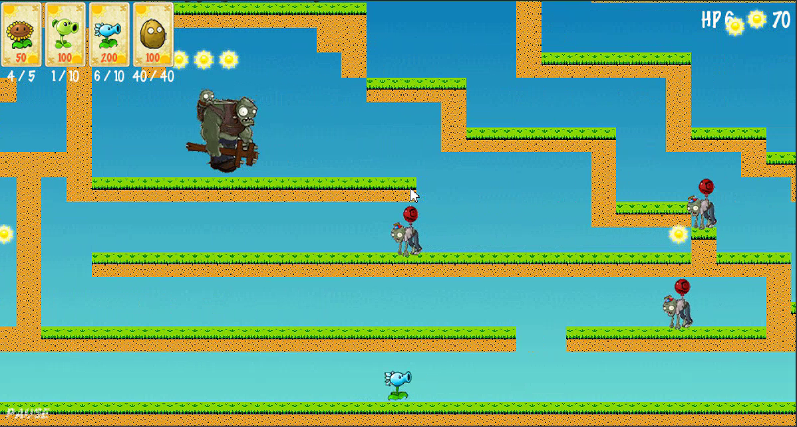
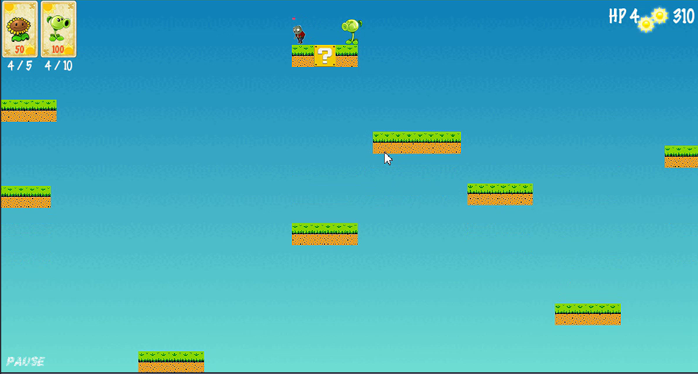
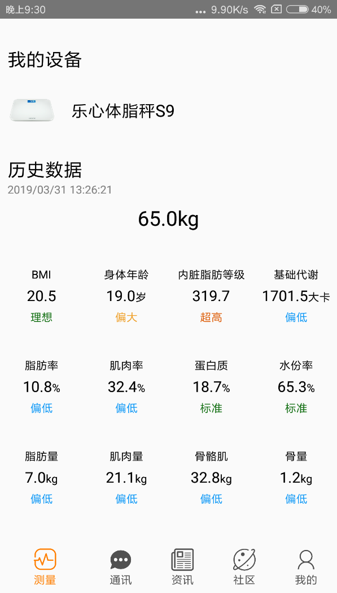
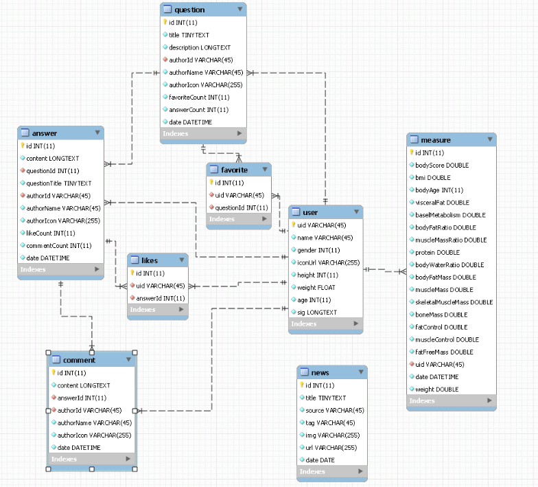

#### Table of contents
- [Welcome to my portfolio](#Welcome-to-my-portfolio)
    
    - [1. Feca(Android)](#1.-Feca(Android))
        - [1.1 Project Introduction](#1.1-Project-Introduction)
        - [1.2 Original Code](#1.2-Original-Code)
    - [2. PlantVsZombie(cocos2d)](#2.-PlantVsZombie(cocos2d))
        - [2.1 Project Introduction](#2.1-Project-Introduction)
        - [2.2 Original Code](#2.2-Original-Code)
    - [3. Im2hungry(Android)](#3.-Im2hungry(Android))
        - [3.1 Project Introduction](#3.1-Project-Introduction)
        - [3.2 Original Code](#3.2-Original-Code)
    - [4. Random Forest(Python)](#4.-Random-Forest(Python))
        - [4.1 Project Introduction](#4.1-Project-Introduction)
        - [4.2 Original Code](#4.2-Original-Code)
    
    - [5. Health Helper(Android + Back-end)](#5.-Health-Helper(Android-+-Back-end))
        - [5.1 Project Introduction](#5.1-Project-Introduction)
        - [5.2 Original Code](#5.2-Original-Code)
#Welcome to my portfolio

I chose the five projects I have done before, including Android development, back-end development, python algorithm implementation, and cocos-2d development.

##1. Feca(Android)

###1.1 Project Introduction

Feca is an Android application which uses face recognition technology. Its main features are virtual makeup test, makeup forum, etc. The software has won the National First Prize and the Most Investment Value Award. I am the captain of a five-man team, product manager and Android developer.

<center></center>
<center>Feca poster</center>
<center></center>
<center>makeup forum</center>
<center></center>
<center>makeup test</center>
###1.2 Original Code

I used retrofit + rxjava to send network requests. This way, I can code the network requests by chain style, and it is very convenient for developers to switch threads. Firstly, before the network request, the uploaded bitmap needs to be converted into a base64 format string, and this step takes time to calculate, so it is done in the computation thread. Secondly, the network request is done in the io thread. This can ensure that multiple threads perform their duties, and main thread won't be blocked by time-consuming operations.

```java
public interface FaceDetectionApi {

    @POST("/youtu/api/faceshape")
    Observable<DetectedFaces> detectFace(@Header("Authorization") String sign, @Body FaceDetection body);

}
```

```java
// request body class
public class FaceDetection {

    @SerializedName("app_id")
    String mAppId;
    @SerializedName("image")
    String mImage;

    public FaceDetection(String image) {
        this.mAppId = Constants.YOUTU_APP_ID;
        this.mImage = image;
    }

    public String getAppId() {
        return mAppId;
    }

    public String getImage() {
        return mImage;
    }


}
```

```java
public class FaceDetectService {

    private static FaceDetectService sFaceDetectService = new FaceDetectService();

    private FaceDetectionApi mFaceDetectionApi;

    public FaceDetectService() {
        mFaceDetectionApi = Youtu.getInstance().getRetrofit()
                .create(FaceDetectionApi.class);
    }

    public static FaceDetectService getInstance() {
        return sFaceDetectService;
    }

    public Observable<DetectedFaces> detect(Bitmap bitmap) {
        return Observable.just(bitmap)
                .observeOn(Schedulers.computation())
                .map(new Function<Bitmap, String>() {
                    @Override
                    public String apply(@NonNull Bitmap bitmap) throws Exception {
                        return Images.toBase64(bitmap);
                    }
                })
                .observeOn(Schedulers.io())
                .flatMap(new Function<String, ObservableSource<DetectedFaces>>() {
                    @Override
                    public ObservableSource<DetectedFaces> apply(@NonNull String imageBase64) throws Exception {
                        return mFaceDetectionApi.detectFace(Youtu.getInstance().sign(),
                                new FaceDetection(imageBase64));
                    }
                });
    }
}
```

The following class describes the key points of organs of the human faces in the uploaded photo. You can use the given key points to describe the shape of the organs.

```java
// network response
public class DetectedFaces {
    /**
     * face data array for positioning all faces in the uploaded image.
     */
    public FaceShapeItem[] face_shape;
    /**
     * the width of the uploaded image.
     */
    public int image_width;
    /**
     * the height of the uploaded image.
     */
    public int image_height;
    /**
     * the error code of the network request.
     */
    public int errorcode;
    /**
     * the error message of the network request.
     */
    public String errormsg;

    public static class FaceShapeItem {
        /**
         * 12 points for positioning face contour
         */
        public Point[] face_profile;
        /**
         * 8 points for positioning left eye
         */
        public Point[] left_eye;
        /**
         * 8 points for positioning right eye
         */
        public Point[] right_eye;
        /**
         * 8 points for positioning left eyebrow
         */
        public Point[] left_eyebrow;
        /**
         * 8 points for positioning right eyebrow
         */
        public Point[] right_eyebrow;
        /**
         * 22 points for positioning mouth
         */
        public Point[] mouth;
        /**
         * 13 points for positioning nose
         */
        public Point[] nose;

        public Point[] getUpperLip() {
            int[] indices = {0, 21, 20, 19, 18, 17, 6, 7, 8, 9, 10, 11};
            Point[] upperLip = new Point[indices.length];
            for(int i = 0; i < indices.length; i++){
                upperLip[i] = mouth[indices[i]];
            }
            return upperLip;
        }


        public Point[] getLowerLip() {
            int[] indices = {0, 1, 2, 3, 4, 5, 6, 16, 15, 14, 13, 12};
            Point[] lowerLip = new Point[indices.length];
            for(int i = 0; i < indices.length; i++){
                lowerLip[i] = mouth[indices[i]];
            }
            return lowerLip;
        }

    }

}
```

Below is the makeup function.

```java
    @Override
    public void makeup(Bitmap image, DetectedFaces.FaceShapeItem face) {
        Canvas canvas = new Canvas(image);
        Paint p = new Paint();
        p.setAntiAlias(true);
        p.setXfermode(new PorterDuffXfermode(PorterDuff.Mode.OVERLAY));
        p.setColor(mColor);
        p.setStrokeJoin(Paint.Join.ROUND);
        canvas.drawPath(Paths.toCatmullRomCurve(face.getLowerLip()), p);
        canvas.drawPath(Paths.toCatmullRomCurve(face.getUpperLip()), p);

    }

```

I also used ButterKnife and AndroidAnnotations to speed up the efficiency of Android development. By using its open annotation apis, we can use it almost anywhere, greatly reducing the amount of irrelevant code, allowing developers to have enough time to focus on the real business logic. And by making your code concise, it also improves the stability of the code and reduce the maintenance cost.

```java
@EActivity(R.layout.activity_makeup)
public class MakeupActivity extends AppCompatActivity {

    @ViewById(R.id.picture)
    ImageView mPhoto;

    @ViewById(R.id.lipsticks)
    RecyclerView mBottomList;

    @ViewById(R.id.toolbar)
    Toolbar mToolbar;

    @ViewById(R.id.makeup_mode)
    TextView mMakeupMode;

    @ViewById(R.id.bottom_bar)
    View mBottomBar;
  ...
    @Click(R.id.close)
    void undoMakeup() {
        mPhoto.setImageBitmap(mFacesMakeup.getOriginalFace());
        exitMakeupMode();
    }
}
```

##2. PlantVsZombie(cocos2d)

###2.1 Project Introduction

PlantVsZombie is a project made in my cocos2d course, inspired by two games that I love very much: Super Mario and Plants vs. Zombies. I used Super Mary's game play mechanics and the character skills of Plants vs Zombies to create this game. This is a four-player team game. I am mainly responsible for game design and cocos2d development.

The rule of the game: press the W/A/D to move the plant, press the J key to attack zombies, press the K key to switch the plant, press the L key to use the collected sunlight to revive the plant, press Enter/ESC: pause the game.







###2.2 Original Code

The following code mainly shows how to initialize the scene and add keyboard listeners which can perform character movement, character attack, character switch, option box popup event, etc.

```c++
cocos2d::Scene * ZVP::createScene(GameConfig config)
{
	srand((unsigned)time(NULL));
	auto scene = Scene::createWithPhysics();

	if (DEBUG) {
		scene->getPhysicsWorld()->setDebugDrawMask(PhysicsWorld::DEBUGDRAW_ALL);
		Director::getInstance()->setDisplayStats(true);
	}
	scene->getPhysicsWorld()->setGravity(GRAVITY);

	auto gameLayer = ZVP::create(config);
	gameLayer->setPhysicsWorld(scene->getPhysicsWorld());
	scene->addChild(gameLayer, 1);

	auto bgLayer = createBackgroundLayer();
	scene->addChild(bgLayer, 0);

	scene->addChild(gameLayer->infoLayer, 2);

	return scene;
}

void ZVP::setPhysicsWorld(PhysicsWorld * world)
{
	m_world = world;
}

Layer* ZVP::createBackgroundLayer() {
	Size visibleSize = Director::getInstance()->getVisibleSize();
	auto bgLayer = Layer::create();
	auto bgSprite = Sprite::create("bg.png");
	bgSprite->setPosition(visibleSize / 2);
	auto visibleSizeWidth = Director::getInstance()->getVisibleSize().width;
	bgSprite->setScale(visibleSizeWidth / bgSprite->getContentSize().width, visibleSize.height / bgSprite->getContentSize().height);
	bgLayer->addChild(bgSprite);
	return bgLayer;
}


bool ZVP::init()
{
	if (!Layer::init()) {
		return false;
	}

	CCLOG(FileUtils::getInstance()->getDefaultResourceRootPath().c_str());

	visibleSize = Director::getInstance()->getVisibleSize();

	loadIdleAnimationInfo();

	loadMap();

	addPlayer();
	
	setViewPoint(players[0]->getPosition());
	renderMapTiles(0, m_map->getMapSize().width);
	renderVisibleMapObjects();

	initGameInfoLayer();

	addListeners();
	preloadMusic();

	
	schedule(schedule_selector(ZVP::update), 0.01f, kRepeatForever, 0.1f);
	schedule(schedule_selector(ZVP::updateEnemys), 0.05f, kRepeatForever, 0.1f);
	schedule(schedule_selector(ZVP::updateGameInfo), 0.05f, kRepeatForever, 0.1f);

	auto level = Label::createWithTTF(TTF_LEVEL, "Level " + to_string(config.getGameLevel()));
	level->setPosition(getPosition() + visibleSize / 2);
	addChild(level, 5);
	level -> runAction(Sequence::create(FadeIn::create(2.0f), FadeOut::create(1.0f), CallFunc::create([=] {
		level->removeFromParent();
	}), nullptr));
	

	return true;
}

void ZVP::addPlayer() {
	for (size_t i = 0; i < config.getPlayerCount(); i++) {
		PlayerInfo *info = new PlayerInfo(config.getPlayerInfo(i));
		string plantName = info->currentPlantName();
		loadIdle(plantName);
		auto player = Sprite::createWithSpriteFrame(SpriteFrameCache::getInstance()->getSpriteFrameByName(plantName));
		player->setTag(tagPlayer);
		player->setPosition(info->initialPosX, info->initialPosY);
		player->setUserData(info);
		setPlayerPlant(player, plantName);
		this->addChild(player, 2);
		players.push_back(player);
	}
}

void ZVP::setPlayerPlant(Sprite *player, const string &name) {
	player->stopActionByTag(tagAnimationPlayerWalking);
	player->stopActionByTag(tagAnimationPlayerAttack);
	((PlayerInfo*)player->getUserData())->isJumping = false;

	loadIdle(name);
	player->setSpriteFrame(SpriteFrameCache::getInstance()->getSpriteFrameByName(name));
	player->setName(name);

	auto body = PhysicsBody::createBox(player->getContentSize(), PhysicsMaterial(100.0f, 0.0f, 1.0f));
	body->setRotationEnable(false);
	body->setContactTestBitmask(0xFFFFFFFF);
	player->setPhysicsBody(body);
}

void ZVP::addListeners() {
	auto keyboardListener = EventListenerKeyboard::create();
	keyboardListener->onKeyPressed = CC_CALLBACK_2(ZVP::onKeyPressed, this);
	keyboardListener->onKeyReleased = CC_CALLBACK_2(ZVP::onKeyReleased, this);
	_eventDispatcher->addEventListenerWithSceneGraphPriority(keyboardListener, this);

	auto contactListener = EventListenerPhysicsContact::create();
	contactListener->onContactBegin = CC_CALLBACK_1(ZVP::onConcactBegin, this);
	contactListener->onContactSeparate = CC_CALLBACK_1(ZVP::onContactSeparate, this);
	_eventDispatcher->addEventListenerWithSceneGraphPriority(contactListener, this);
}

void ZVP::onKeyPressed(EventKeyboard::KeyCode code, Event * event) {
	auto player = 0;
	for (size_t i = 1; i < players.size(); i++) {
		auto keyCodeMapper = config.getKeyCodeMapper(i);
		auto keyCode = keyCodeMapper.find(code);
		if (keyCode != keyCodeMapper.end()) {
			player = i;
			code = keyCode->second;
			break;
		}
	}
	switch (code) {
	case KeyCode::KEY_ESCAPE:
	case KeyCode::KEY_ENTER:
	case KeyCode::KEY_KP_ENTER:
		pauseAndShowMenu();
		break;
	case cocos2d::EventKeyboard::KeyCode::KEY_SPACE:
		saveGame();
		break;
	default:
		onPlayerKeyPressed(player, code, event);
	}
}

void ZVP::pauseAndShowMenu() {
	if (infoLayer->getChildByName("shadow")) {
		return;
	}
	pauseGame();
	
	auto shadow = ButtonMenuBuilder::createShadow(visibleSize, visibleSize / 2);
	shadow->setName("shadow");
	infoLayer->addChild(shadow);

	auto dismissMenu = [=](Ref *ref) {
		(dynamic_cast<Button*>(ref))->getParent()->removeFromParent();
		infoLayer->getChildByName("shadow")->removeFromParent();
		Director::getInstance()->resume();
	};

	auto menu = ButtonMenuBuilder()
		.font("fonts/ChronicGothic.ttf")
		.fontSize(46)
		.margin(10)
		.addItem("RESUME", [=](Ref* ref) {
			dismissMenu(ref);
			resumeGame();
		})
		.addItem("SAVE", [=](Ref* ref) {
			dismissMenu(ref);
			saveGame();
			resumeGame();
		})
		.addItem("SAVE AND BACK", [=](Ref* ref) {
			saveGame();
			resumeGame();
			Director::getInstance()->replaceScene(StartScene::createScene());
		})
		.addItem("BACK", [=](Ref* ref) {
			resumeGame();
			Director::getInstance()->replaceScene(StartScene::createScene());
		})
		.build();
	menu->setPosition(visibleSize / 2);
	infoLayer->addChild(menu);
}

void ZVP::onMenuTouchEvent(Ref* ref, Widget::TouchEventType type) {
	auto shadow = infoLayer->getChildByName("shadow");
	if (shadow) {
		shadow->removeFromParent();
	}
	auto button = dynamic_cast<Button*>(ref);
	string title = button->getTitleText();
	button->getParent()->removeFromParent();
	if (title == "SAVE" || title == "EXIT & SAVE") {
		saveGame();
	}
	if (title == "EXIT" || title == "EXIT & SAVE") {
		
	}
}

void ZVP::onPlayerKeyPressed(int i, EventKeyboard::KeyCode code, Event * event) {
	if (players.size() <= i) {
		return;
	}
	string plants[] = { "WallNut", "Repeater", "Jalapeno", "SnowPea", "PeaShooter" };
	auto player = players[i];
	auto playerInfo = (PlayerInfo*)player->getUserData();
	auto &plantInfo = playerInfo->plantInfo[player->getName()];
	switch (code) {
	case KeyCode::KEY_A:
	case KeyCode::KEY_CAPITAL_A:
	case KeyCode::KEY_D:
	case KeyCode::KEY_CAPITAL_D:
	case KeyCode::KEY_W:
	case KeyCode::KEY_CAPITAL_W:
			movePlayer(player, code);
		break;
	case KeyCode::KEY_J: {
		if (Tools::currentTimeInMillis() - playerInfo->lastAttackingTime < plantInfo.attackDelay) {
			break;
		}
		auto attackAction = RepeatForever::create(Sequence::create(CallFunc::create([=] {
			makeAttack(player);
		}), DelayTime::create(plantInfo.repeatedAttackDelay), nullptr));
		attackAction->setTag(tagActionPlayerAttacking);
		player->runAction(attackAction);
		break;
	}
	case KeyCode::KEY_K: {
		//switch character
		if (playerInfo->plantCount() <= 1) {
			break;
		}
		if (isAudioEnabled) {
			audio.play2d("music/Plant.mp3", false);
		}
		playerInfo->switchPlant();
		setPlayerPlant(player, playerInfo->currentPlantName());
		break;
	}
	case KeyCode::KEY_L:
		//revive character
		if (plantInfo.healthPoint > 0 || plantInfo.isFrozen || playerInfo->sunlight < plantInfo.requiredSunlight) {
			break;
		}
		if (isAudioEnabled) {
			audio.play2d("music/GrowPlant.mp3", false);
		}
		playerInfo->sunlight -= plantInfo.requiredSunlight;
		plantInfo.healthPoint = plantInfo.totalHealthPoint;
		break;
	case KeyCode::KEY_I: {
		//for test：create some zombies
		string zombies[] = { "Zombie", "Ballon", "Gargantuar", "Snowman", "Spaceman", "CurlyHair", "Imp", "Diver", "Tie", "Conehead" };
		for (int i = 0; i < 10; i++) {
			auto zombie = createZombie(zombies[i]);
			zombie->setPosition(player->getPosition() + Vec2(i * 32, 0));
			enemys.insert(zombie);
			addChild(zombie, 2);
		}
		break;
	}
	case KeyCode::KEY_O: {
		//cheat: increase health point
		plantInfo.healthPoint++;
		break;
	}
	}
}

void ZVP::onKeyReleased(EventKeyboard::KeyCode code, Event * event) {
	auto player = 0;
	for (size_t i = 1; i < players.size(); i++) {
		auto keyCodeMapper = config.getKeyCodeMapper(i);
		auto keyCode = keyCodeMapper.find(code);
		if (keyCode != keyCodeMapper.end()) {
			player = i;
			code = keyCode->second;
			break;
		}
	}
	switch (code) {
	case KeyCode::KEY_A:
	case KeyCode::KEY_CAPITAL_A:
	case KeyCode::KEY_D:
	case KeyCode::KEY_CAPITAL_D:
	case KeyCode::KEY_W:
	case KeyCode::KEY_CAPITAL_W:
		if (players.size() > player) {
			stopPlayer(players[player], code);
		}
		break;
	case KeyCode::KEY_J:
		if (players.size() > player) {
			players[player]->stopActionByTag(tagActionPlayerAttacking);
		}
		break;
	}
}

void ZVP::movePlayer(Sprite* player, EventKeyboard::KeyCode code) {
	auto body = player->getPhysicsBody();
	auto velocity = body->getVelocity();
	auto playerInfo = (PlayerInfo*)player->getUserData();
	auto &plantInfo = playerInfo->currentPlantInfo();
	switch (code) {
	case cocos2d::EventKeyboard::KeyCode::KEY_A:
	case cocos2d::EventKeyboard::KeyCode::KEY_CAPITAL_A:
		playerInfo->velocityX = plantInfo.healthPoint > 0 ? -plantInfo.velocity : -30;
		body->setVelocity(Vec2(playerInfo->velocityX, velocity.y));
		player->setFlippedX(true);
		break;
	case cocos2d::EventKeyboard::KeyCode::KEY_D:
	case cocos2d::EventKeyboard::KeyCode::KEY_CAPITAL_D:
		playerInfo->velocityX = plantInfo.healthPoint > 0 ? plantInfo.velocity : 30;
		body->setVelocity(Vec2(playerInfo->velocityX, velocity.y));
		player->setFlippedX(false);
		break;
	case cocos2d::EventKeyboard::KeyCode::KEY_W:
	case cocos2d::EventKeyboard::KeyCode::KEY_CAPITAL_W:
		if (playerInfo->isJumping) {
			break;
		}
		playerInfo->isJumping = true;
		body->setVelocity(Vec2(velocity.x, plantInfo.healthPoint > 0 ? plantInfo.jumpingVelocity : 100));
		if (isAudioEnabled) {
			player->runAction(CallFunc::create([=] {
				audio.play2d("music/jump.mp3", false);
			}));
		}
		
		break;
	}
}

void ZVP::stopPlayer(Sprite* player, EventKeyboard::KeyCode code) {
	auto body = player->getPhysicsBody();
	auto playerInfo = (PlayerInfo*)player->getUserData();
	switch (code) {
	case cocos2d::EventKeyboard::KeyCode::KEY_A:
	case cocos2d::EventKeyboard::KeyCode::KEY_CAPITAL_A:
	case cocos2d::EventKeyboard::KeyCode::KEY_D:
	case cocos2d::EventKeyboard::KeyCode::KEY_CAPITAL_D:
		playerInfo->velocityX = 0;
		break;
	}
}


void ZVP::makeAttack(Sprite *player) {
	PlayerInfo* playerInfo = (PlayerInfo*)player->getUserData();
	auto &plantInfo = playerInfo->plantInfo[player->getName()];
	if (plantInfo.healthPoint <= 0) {
		return;
	}
	if (player->getName() == "PeaShooter" || player->getName() == "Repeater" || player->getName() == "SnowPea") {
		shootPea(player);
		playerInfo->lastAttackingTime = Tools::currentTimeInMillis();
		return;
	}
	if (player->getName() == "Jalapeno") {
		boom(player);
		return;
	}
}

void ZVP::shootPea(Sprite *player) {
	string peaName = "Pea";
	float peaVolecity = 800, peaOffsetY = 14;
	if (player->getName() == "SnowPea") {
		peaName = "FrozenPea";
		peaOffsetY = 18;
	}
	else if (player->getName() == "Repeater") {
		peaOffsetY = 13;
	}
	auto shootPea = [=]()->void {
		auto pea = createSprite(peaName);
		pea->setName(peaName);
		pea->setTag(tagPea);
		auto body = PhysicsBody::createBox(pea->getContentSize(), PHYSICSSHAPE_MATERIAL_DEFAULT);
		body->setContactTestBitmask(0xFFFFFFFF);
		body->setGravityEnable(false);
		pea->setPhysicsBody(body);
		if (player->isFlippedX()) {
			body->setVelocity(Vec2(-800, 0));
			pea->setPosition(player->getPosition() + Vec2(-player->getContentSize().width / 2 + 9, player->getContentSize().height / 2 - peaOffsetY));
		}
		else {
			body->setVelocity(Vec2(800, 0));
			pea->setPosition(player->getPosition() + Vec2(player->getContentSize().width / 2 - 9, player->getContentSize().height / 2 - peaOffsetY));
		}
		addChild(pea, 2);
		if (isAudioEnabled) {
			pea->runAction(CallFunc::create([=] {
				audio.play2d(("music/" + player->getName() + "Attack.mp3").c_str(), false);
			}));
		}
		
	};
	if (player->getName() == "Repeater") {
		player->runAction(Sequence::create(CallFunc::create(shootPea), DelayTime::create(0.02f), CallFunc::create(shootPea), nullptr));
	}
	else if (player->getName() == "SnowPea") {
		shootPea();
	}
	else {
		player->stopActionByTag(tagAnimationPlayerAttack);
		auto seq = Sequence::create(Animate::create(AnimationCache::getInstance()->getAnimation(player->getName() + "Attack")), CallFunc::create(shootPea), nullptr);
		seq->setTag(tagAnimationPlayerAttack);
		player->runAction(seq);
	}
}

void ZVP::boom(Sprite *player) {
	loadAnimation("Fire", 14, Size(26, 20), 0.25f);
	player->setScale(0.7f);
	player->runAction(Sequence::create(ScaleTo::create(2.0f, 1.3f), CallFunc::create([=]()->void {
		auto playerInfo = (PlayerInfo*)player->getUserData();
		playerInfo->currentPlantInfo().die();
		setPlayerPlant(player, playerInfo->switchPlant());
		player->setScale(1);
		auto fireAnim = AnimationCache::getInstance()->getAnimation("Fire");
		for (int i = -5; i <= 5; i++) {
			Sprite* fire = Sprite::create();
			fire->setTag(tagFire);
			auto body = PhysicsBody::createBox(Size(26, 20));
			body->setDynamic(false);
			body->setCollisionBitmask(0);
			body->setContactTestBitmask(0xFFFFFFFF);
			fire->setPhysicsBody(body);
			fire->setPosition(player->getPosition().x + i * 32, player->getPosition().y - 20);
			addChild(fire, 3);
			fire->runAction(Sequence::create(Animate::create(fireAnim), CallFunc::create([fire]()->void {
				fire->removeFromParent();
			}), nullptr));
			if (isAudioEnabled) {
				audio.play2d("music/fire.mp3", false);
			}
		}

	}), nullptr));


}
```

##3. Im2hungry(Android)

###3.1 Project Introduction

Im2hungry is a project that I developed in the intern competition during my internship at Tencent. The software won the gold award in the competition. As the name suggests, Im2hungry is a food recommendation app based on LBS. It also uses AI technology to support the calorie recognition function of food. Our goal is to allow users to choose foods they want to eat nearby when browsing the food posts.

Our team is made up of 11 people, including product manager, UI designer, android developer, back-end developer, test engineer and food recognition algorithm engineer. I am responsible for android development.

<center>
  <video src="./assets/images/im2hungry_video.mov" controls="controls" width="960" height="480" align="center">
  Your browser does not support the video tag.
  </video>
</center>

<center>Video Introduction Of Im2hungry</center>
###3.2 Original Code

In order to make it easier for users to find delicious food,  I proposed to tthe product manager to add geographic location services, that is, to include geographic location information in users posts. This proposal has been unanimously approved by the team members. I chose to use Tencent Maps SDK to provide map services.

```java
public class LocationService {

    private static final String LOG_TAG = LocationService.class.getSimpleName();
    private static LocationService sInstance;
    private final AMapLocationClient mLocationClient;
    private final AMapLocationListener mLocationListener = new AMapLocationListener() {
        @Override
        public void onLocationChanged(AMapLocation aMapLocation) {
            mLat = aMapLocation.getLatitude();
            mLng = aMapLocation.getLongitude();
            Log.d(LOG_TAG,"Lat: " + mLat + "Lng" + mLng);
        }
    };
    private final AMapLocationClientOption mLocationOption;
    private double mLat;
    private double mLng;

    public static LocationService getInstance() {
        return sInstance;
    }

    public static void initInstance(Context context) {
        if (sInstance != null)
            return;
        sInstance = new LocationService(context);
    }

    public LocationService(Context context) {
        mLocationClient = new AMapLocationClient(context);
        mLocationClient.setLocationListener(mLocationListener);
        mLocationOption = new AMapLocationClientOption();
        mLocationOption.setLocationMode(AMapLocationClientOption.AMapLocationMode.Battery_Saving);
        mLocationClient.setLocationOption(mLocationOption);
        mLocationClient.startLocation();
    }

    public double getLat() {
        return mLat;
    }

    public double getLng() {
        return mLng;
    }
}
```

Calculate the distance between the location information contained in the post and the user's current location.

```java
private String getDistance(PostInfo postInfo) {

        double distance = CalculateDistance.algorithm(postInfo.getLocLng(), postInfo.getLocLat(), LocationService.getInstance().getLng(), LocationService.getInstance().getLat());
        if (distance >= 1000) {
            return (String.valueOf(distance / 1000) + "km");
        }
        return String.valueOf(distance) + "m";
    }
```

Class for calculating distance

```java
public class CalculateDistance {
    public static int algorithm(double longitude1, double latitude1, double longitude2, double latitude2) {

        double Lat1 = rad(latitude1);

        double Lat2 = rad(latitude2);

        double a = Math.abs(Lat1 - Lat2);//Latitude difference between two points

        double b = Math.abs(rad(longitude1) - rad(longitude2)); //Longtitude difference between two points

        double s = 2 * Math.asin(Math

                .sqrt(Math.pow(Math.sin(a / 2), 2) + Math.cos(Lat1) * Math.cos(Lat2) * Math.pow(Math.sin(b / 2), 2)));//Formula for calculating the distance between two points

        s = s * 6378137.0;//Arc length times Earth radius (radius in meters)

        s = Math.round(s * 10000d) / 10000d;

        return (int)s;

    }

    private static double rad(double d) {
        return d * Math.PI / 180.00; //Convert angles to radians
    }

}
```

Show the location on the map according to its latitude and longitude and mark it with red markers

```java

public class LocationSeeActivity extends AppCompatActivity {
    private static final String TAG = "Location Activity";
    private MapView mapView = null;
    private AMap aMap = null;
    private ListView searchResultListView;

    private AMapLocationClient mLocationClient = null;
    private AMapLocationClientOption mLocationOption = null;
    private LocationSource.OnLocationChangedListener mListener = null;
    private Marker locationMarker = null;
    private EditText mSearchEditText;

    private ImageView mChoose,mBack;

    private boolean isInputKeySearch;
    private String inputSearchKey;

    private double lat,lng;
    @Override
    protected void onCreate(@Nullable Bundle savedInstanceState) {
        super.onCreate(savedInstanceState);
        setContentView(R.layout.activity_locationsee);
        mapView = (MapView) findViewById(R.id.map);
        mapView.onCreate(savedInstanceState);
        aMap = mapView.getMap();

        lat = getIntent().getDoubleExtra("lat",0);
        lng = getIntent().getDoubleExtra("lng",0);
        LatLng latLng = new LatLng(lat,lng);
        setUpMap();
        final Marker marker = aMap.addMarker(new MarkerOptions().position(latLng));

        mBack = (ImageView)findViewById(R.id.back);
        mBack.setOnClickListener(new View.OnClickListener() {
            @Override
            public void onClick(View view) {
                finish();
            }
        });
    }

    @Override
    protected void onResume() {
        super.onResume();
        mapView.onResume();
    }

    @Override
    protected void onPause() {
        super.onPause();
        mapView.onPause();
    }

    @Override
    protected void onDestroy() {
        super.onDestroy();
        mapView.onDestroy();
    }

    /**
     * set amap attributes
     */
    private void setUpMap() {
        LatLng curLatlng = new LatLng(lat, lng);
        aMap.moveCamera(CameraUpdateFactory.newLatLngZoom(curLatlng, 22f));
    }
}
```

##4. Random Forest(Python)

###4.1 Project Introduction

This experiment uses a random forest algorithm. The data comes from kaggle. The training dataset is given M = 1719692 samples, the sample form is {(X1, y1), (X2, y2) ... (XM, yM)}, where Xj = {xji | i = 1,2, ... N} is a real vector of N = 201 dimensions, yj is 1 or 0, which is the classification label: 1 means the sample is a positive sample, 0 means the sample is a negative sample; The test data set is given M = 429923 samples, and the classification labels of the samples are required.

A forest is created randomly. There are many decision trees in the forest. Each decision tree in the random forest is not related to others and is a relatively weak classifier. However, after combining many trees, the forest has a very strong classification ability. When a new input sample enters, let each decision tree in the forest judge separately to see which label this sample should belong to, and then see which label is selected the most, and then make prediction.

另外我还使用了multiprocessing来增加运算的速度

###4.2 Original Code

```python
from multiprocessing import Process,Pool,Manager
from sklearn import ensemble as en
import numpy as np
import random
import math
import os
import re
import time
import copy
import operator

'''
load train data
'''
starttime = time.time()
# load train data to list
train_x_index = list()
train_x_value = list()
train_y = list()

line_num = 0
index_max = 0

with open('train.txt', 'rb') as fr:
    for line in fr:
        tmp = re.split(' ',line.strip())
        train_y.append(tmp[0])
        if len(tmp)>1:
            tmp_index = list()
            tmp_value = list()
            for i in range(1,len(tmp)):
                feature = tmp[i].split(':')            
                tmp_index.append(int(feature[0]))
                tmp_value.append(float(feature[1]))
            #print line_num, tmp_index, tmp_value
            train_x_index.append(tmp_index)
            train_x_value.append(tmp_value)
        line_num = line_num + 1

# transfer train_y from list to ndarray
np.asarray(train_y).astype(int)
# transfer train data to numpy 
sample_num = len(train_x_index)
feature_num = max(max(train_x_index))+1 # one column for label, so the total number of column needs plus 1

train_data = np.zeros([sample_num,feature_num])
for i in range(sample_num):
    train_data[i,0] = train_y[i] # the first column is label
    for j in range(len(train_x_index[i])):
        train_data[i,train_x_index[i][j]] = train_x_value[i][j]
print "load train data finished.   spend: ", time.time() - starttime, "s"


'''
load test data
'''
starttime = time.time()
# load test data to list
test_x_index = list()
test_x_value = list()
test_y = list()

line_num = 0
index_max = 0

with open('test.txt', 'rb') as fr:
    for line in fr:
        tmp = re.split(' ',line.strip())
        test_y.append(tmp[0])
        if len(tmp)>1:
            tmp_index = list()
            tmp_value = list()
            for i in range(1,len(tmp)):
                feature = tmp[i].split(':')            
                tmp_index.append(int(feature[0]))
                tmp_value.append(float(feature[1]))
            #print line_num, tmp_index, tmp_value
            test_x_index.append(tmp_index)
            test_x_value.append(tmp_value)
        line_num = line_num + 1

# transfer test_y from list to ndarray
np.asarray(test_y).astype(int)
# transfer test data to numpy 
test_sample_num = len(test_x_index)

test_data = np.zeros([test_sample_num,feature_num])
for i in range(test_sample_num):
    test_data[i,0] = test_y[i] # the first column is index
    for j in range(len(test_x_index[i])):
        test_data[i,test_x_index[i][j]] = test_x_value[i][j]
print "load test data finished.   spend: ", time.time() - starttime, "s"


'''
bootstrap
input:
    num_selected_sample: int, the number of samples you want select
    num_selected_feature: int, the number of features you want select
    
output:
    selected_sample: ndarray, random selected samples with labels and all features
    selected_feature_index: list, the index of features you want select
'''
def bootstrap(num_selected_sample, num_selected_feature):
    selected_sample_index = (np.random.sample(num_selected_sample) * sample_num).astype(int)
    selected_feature_index = (np.random.sample(num_selected_feature) * feature_num).astype(int)

    # for test
#    selected_sample_index = range(20)
#    selected_feature_index = [15,47,92,93,94,95,96,97,107,108,109]

    # transfer selected_feature_index form numpy to list and remove feature 0
    selected_feature_index = list(selected_feature_index)
    if 0 in selected_feature_index:
        selected_feature_index = selected_feature_index.remove(0)
    
    # get the selected sample data (with label and all features)
    selected_sample = train_data[selected_sample_index,:]
    
    # do not forget return the selected index of feature
    return selected_sample, selected_feature_index


'''
binary_split
input:
    data: ndarray, current piece of train data with labels and all features
    feature_index: int, one index of feature
    key_value: float, the threshold of feature to split
output:
    left_data: ndarray, piece of data with value >= key_value in the sepcified feature
    right_data: ndarray, piece of data with value < key_value in the specified feature
'''

def binary_split(data, feature_index, key_value):  
    tmp_data = data[:,feature_index]
    #print tmp_data
    left_data = data[tmp_data >= float(key_value)]
    right_data = data[tmp_data < float(key_value)]
    #print left_data[:,feature_index],right_data[:,feature_index]
    return left_data, right_data


'''
compute entropy
input: list, labels of selected train data
output: float, the result of calculation of entropy
'''
def get_entropy(labels):
    entropy = 0.0
    if len(labels) <= 1:
        return 0
    num_class0 = labels.count(float(0.0))
    num_class1 = labels.count(float(1.0))   
    if num_class0 != 0:
        prob = float(num_class0) / len(labels)
        entropy -= prob * math.log(prob,2)
    if num_class1 != 0:
        prob = float(num_class1) / len(labels)
        entropy -= prob * math.log(prob,2)
    return entropy


'''
select_split_feature
input:
data: ndarray, train data
selected_feature_index: list, selected indexes of feature
output: 
split_feature: int, index of the best feature to split
key_value: float, the split value of that feature
'''
def select_split_feature(data, selected_feature_index):  
    split_feature = None # the best feature to be splitted
    key_value = 0
    max_infogain = 0.0
    base_entropy = get_entropy(list(data[:,0])) # the entropy before split
    
    # for each selected feature, calculate infogain assuming it splitted
    for i in selected_feature_index:
        feature_values = data[:,i]
        
        # remove the repeat feature_values using set and transfer to list for sort
        sorted_feature_values = list(set(feature_values))
        sorted_feature_values.sort()

        resample_values = []
        if len(sorted_feature_values) > 5:
            for x in range(1,7):
                resample = int(0.16*x*len(sorted_feature_values))
                resample_values.append(sorted_feature_values[resample])
        else:
            resample_values = sorted_feature_values
        
        for value in resample_values:
            left_data , right_data = binary_split(data, i, value)
            left_labels = list(left_data[:,0])
            right_labels = list(right_data[:,0])
            prob_left = len(left_data) / float(len(data))
            prob_right = len(right_data) / float(len(data))
            current_entropy = prob_left * get_entropy(left_labels) + prob_right * get_entropy(right_labels)
            infogain = base_entropy - current_entropy
            #print i, value, infogain
            if (infogain > max_infogain):
                max_infogain = infogain
                split_feature = i
                key_value = value
                
    # remove the best feature of current and get the rest
    if split_feature != None:
        selected_feature_index.remove(split_feature)
    return split_feature, key_value, selected_feature_index


def build_decision_tree(data, selected_feature_index):
    # condition 1: all labels belong to the same class
    # and there is no need to split
    labels = list(data[:,0])
    if labels.count(float(0.0)) >= 0.95 * len(labels):
        return float(0.0)
    if labels.count(float(1.0)) >= 0.95 * len(labels):
        return float(1.0)
    
    if selected_feature_index is None:
        if labels.count(float(0.0)) >= labels.count(float(1.0)):
            return float(0.0)
        else:
            return float(1.0)
    
    # step 1: choose the best feature and value for split
    split_feature,key_value,rest_feature_index = select_split_feature(data,selected_feature_index)
    
    # condition 2: when there is no available split feature
    if split_feature == None:
        if labels.count(float(0.0)) >= labels.count(float(1.0)):
            return float(0.0)
        else:
            return float(1.0)
    
    copy_rest_feature_index = copy.deepcopy(rest_feature_index)
    
    # step 2: use the best feature and value to split data to left and right child
    right_child, left_child = binary_split(data, split_feature, key_value)

    # normal: recursively build decision tree
    '''
    the tuple(split_feature, key_value) represents a node
    use tuple(split_feature, key_value) to index the tree
    '''
    tree = {(split_feature, key_value):{}}
    tree[(split_feature, key_value)][0] = build_decision_tree(left_child , rest_feature_index)
    tree[(split_feature, key_value)][1] = build_decision_tree(right_child ,copy_rest_feature_index)  
    
    return tree


def classify(tree, sample):
    result = None
    next_node = None
    
    node = tree.keys()[0]
    child = tree[node]
    
    feature_index = node[0]
    key_value = node[1]
    
    #print sample.shape, sample[105],type(feature_index),feature_index
    feature_value = sample[int(feature_index)]

    if feature_value >= key_value:
        next_node = child[1] # left child
    else:
        next_node = child[0] # right child
        
    if isinstance(next_node, dict):
        result = classify(next_node, sample)
    else:
        result = next_node
    return result


def random_forest_training(num_tree,forest):
    for i in range(num_tree):
        tmp_train_data, tmp_train_feature = bootstrap(100000,20)  
        forest.append(build_decision_tree(tmp_train_data,tmp_train_feature))
        print "Tree %d has been built" % i

def random_forest_classify(forest, entries, results):
    count = 0
    display_results = []
    for entry in entries:
        tmp_results = list()
        for tree in forest:
            tmp_results.append(classify(tree, entry))
        results.append(tmp_results)
        temp_str = "Sample " + str(count) + " : " + str(tmp_results.count(float(0.0))) + \
        " trees vote for class [0], " + str(tmp_results.count(float(1.0))) + " trees vote for class [1]"
        display_results.append(temp_str)
        count += 1
    return display_results


def multiprocess_random_forest_training(num_process, num_trees):
    threads = []  
    num_trees_per_thread = int(float(num_trees) / float(num_process))
    
    # a started SyncManager object which can be used for
    # sharing objects between processes
    manager = Manager()
    # create a list proxy for appending a mutable object to it later
    forest = manager.list()

    print "Start multiprocess random forest training."

    # start processes with number of num_process
    p = Pool(num_process)
    for i in range(num_process):
        tmp_forest = manager.list()
        threads.append({'thread':i , 'forest':tmp_forest})
        # evaluate result of random_forest_training asynchronously in a single process
        p.apply_async(random_forest_training, args = (num_trees_per_thread,tmp_forest))

    print 'Waiting for all subprocesses to be done...'
    p.close() # prevents any more tasks from being submitted to the pool
    p.join() # wait for the worker processes to exit

    print 'All subprocesses done.'

    # combine each thread forest to one whole forest
    for i in range(num_process):
        #print threads[i]['forest']
        forest.extend(threads[i]['forest'])
    return forest


def multiprocess_random_forest_predicting(forest,test_data,num_process):
    # a started SyncManager object which can be used for
    # sharing objects between processes
    manager = Manager()

    num_trees_per_thread = int(len(forest) / float(num_process))
    predicts = []

    # start processes with number of num_process
    print "Start multiprocess random forest predicting."
    p = Pool(num_process)
    for i in range(num_process):
        start = i * num_trees_per_thread
        end = (i + 1) * num_trees_per_thread
        tmp_predict = manager.list()
        predicts.append({'ind_process': i , 'predict': tmp_predict})
        p.apply_async(random_forest_classify, args = (forest[start:end],test_data,tmp_predict))

    p.close()
    p.join()

    print "All multiprocess random forest predicting Done"
    num_arr = np.asarray(predicts[0]['predict']).astype(int)

    for i in range(1,num_process):
        num_arr += np.asarray(predicts[i]['predict']).astype(int)
    res = num_arr/float(len(forest))
    return np.sum(res,axis=1)
   # return (num_arr >= int(0.5 * len(forest))).astype(int)


# for single process
'''
forest = []
starttime = time.time()
random_forest_training(500,forest)
print "random forest training done.   spend: ", time.time() - starttime, "s"

results = []
starttime = time.time()
res = random_forest_classify(forest,test_data,results)
print "random forest classify done.   spend: ", time.time() - starttime, "s"
'''


starttime = time.time()
forest = multiprocess_random_forest_training(10,500)
print "multiprocess random forest trianing done.   spend: ", time.time() - starttime, "s"

starttime = time.time()
res = multiprocess_random_forest_predicting(forest,test_data,10)
print "multiprocess random forest predicting done.   spend: ", time.time() - starttime, "s"


with open('result.txt','w') as fw:
    fw.write('id,laebl\n')
    for x in range(10):
        fw.write(str(x)+','+str(res[x])+'\n')
```

##5. Health Helper(Android + Back-end)

###5.1 Project Introduction

Health Helper is an Android application developed by my graduation design. Its main function is to measure various human data, health news, health forum, and instant messaging. In this project I was responsible for the development of the measurement and instant messaging functions on the Android side, as well as the back-end development.

As shown in the figure, various data of the human body are displayed, such as BMI value, body age, visceral fat registration, basal metabolism, fat rate, muscle rate, protein rate, moisture, skeletal muscle, etc.

<div align=center></div>
<center>measurement main page</center>
<div align=center></div>
<center>physical report with suggestions</center>
<center></center>
<center>chatroom main page</center>
<center></center>
<center>chatroom</center>
###5.2 Original Code

下面的代码展示了如何通过蓝牙搜寻体脂秤设备，配对设备，连接设备的过程。

```java
public class MeasureDeviceHolder extends RecyclerView.ViewHolder {
	@BindView(R.id.device_info)
	LinearLayout deviceInfo;
	@BindView(R.id.pair_device)
	TextView pairDevice;
	Context mContext;

	public MeasureDeviceHolder(Context context,@NonNull View itemView) {
		super(itemView);
		mContext = context;
		ButterKnife.bind(this,itemView);
	}

	public void setDeviceLayout(){
		new Thread(() -> {
			deviceInfo.post(() -> deviceInfo.setVisibility(View.VISIBLE));
			pairDevice.post(() -> pairDevice.setVisibility(View.GONE));
		}).start();
	}

	@OnClick(R.id.pair_device)
	public void onClicked() {
		LsBleManager.getInstance().searchLsDevice(mSearchCallback, getDeviceTypes(), BroadcastType.ALL);
	}

	private SearchCallback mSearchCallback = new SearchCallback() {
		@Override
		public void onSearchResults(LsDeviceInfo lsDevice) {
			Logger.d(lsDevice);
			ManagerStatus status = LsBleManager.getInstance().getLsBleManagerStatus();
			switch (status) {
				case DATA_RECEIVE:
					LsBleManager.getInstance().stopDataReceiveService();
					break;
				case DEVICE_SEARCH:
					LsBleManager.getInstance().stopSearch();
					break;
				case DEVICE_PAIR:
					LsBleManager.getInstance().cancelDevicePairing(lsDevice);
					break;
				case UPGRADE_FIRMWARE_VERSION:
					LsBleManager.getInstance().cancelAllUpgradeProcess();
					break;
			}
			LsBleManager.getInstance().pairingWithDevice(lsDevice, mPairCallback);
		}
	};

	private List<DeviceType> getDeviceTypes(){
		//返回扫描所有的设备类型
		List<DeviceType> mScanDeviceType = new ArrayList<>();
		mScanDeviceType.add(DeviceType.SPHYGMOMANOMETER);
		mScanDeviceType.add(DeviceType.FAT_SCALE);
		mScanDeviceType.add(DeviceType.WEIGHT_SCALE);
		mScanDeviceType.add(DeviceType.HEIGHT_RULER);
		mScanDeviceType.add(DeviceType.PEDOMETER);
		mScanDeviceType.add(DeviceType.KITCHEN_SCALE);
		return mScanDeviceType;
	}

	private PairCallback mPairCallback = new PairCallback() {
		@Override
		public void onPairResults(LsDeviceInfo lsDeviceInfo, int i) {
			super.onPairResults(lsDeviceInfo, i);
			if (lsDeviceInfo != null) {
				connectDevice(lsDeviceInfo);
			} else {
				Log.d("Prompt", "Pairing failed, please try again");
			}
		}
	};

	private void connectDevice(LsDeviceInfo lsDeviceInfo){
		if (!LsBleManager.getInstance().isOpenBluetooth()) {
			Toast.makeText(mContext, R.string.open_bluetooth_hint,Toast.LENGTH_SHORT).show();
			return;
		}
		if (lsDeviceInfo == null) {
			Toast.makeText(mContext, R.string.no_device_hint,Toast.LENGTH_SHORT).show();
			return;
		}
		if (LsBleManager.getInstance().checkDeviceConnectState(lsDeviceInfo.getMacAddress()) == DeviceConnectState.CONNECTED_SUCCESS) {
			LsBleManager.getInstance().registerDataSyncCallback(mDataCallback);
			return;
		}
		if (LsBleManager.getInstance().getLsBleManagerStatus() == ManagerStatus.DATA_RECEIVE) {
			return;
		}
		LsBleManager.getInstance().stopDataReceiveService();
		//clear measure measure_device list
		LsBleManager.getInstance().setMeasureDevice(null);
		//add target measurement measure_device
		LsBleManager.getInstance().addMeasureDevice(lsDeviceInfo);
		//start data syncing service
		LsBleManager.getInstance().startDataReceiveService(mDataCallback);
		setDeviceLayout();
	}

	private ReceiveDataCallback mDataCallback = new ReceiveDataCallback() {
		@Override
		public void onReceiveWeightData_A3(WeightData_A3 weightData_a3) {
			super.onReceiveWeightData_A3(weightData_a3);
			Logger.d("MeasureFragment",weightData_a3.toString());
		}
	};
}

```

因为是合作开发项目，所以我将后台服务器和数据库部署到了云服务器上，方便其他人可以随时请求后台数据。


下面是后端代码，首先是app.js文件，该文件是项目入口及程序启动文件。

```javascript
var createError = require('http-errors');
var express = require('express');
var path = require('path');
var cookieParser = require('cookie-parser');
var logger = require('morgan');
var session = require('express-session');
var bodyParser = require('body-parser');
var config = require('./config');

var app = express();

// view engine setup
app.set('views', path.join(__dirname, 'views'));
app.set('view engine', 'jade');

app.use(logger('dev'));
app.use(bodyParser.json({limit: '50mb'}));
app.use(bodyParser.urlencoded({ limit: '50mb', extended: true }));
app.use(cookieParser());
app.use(express.static(path.join(__dirname, config['dir.uploads'])));
app.set('trust proxy', 1);
app.use(session({
  secret: config['session.secret'],
  resave: true,
  store: new session.MemoryStore(),
  saveUninitialized: true,
  cookie: { secure: false }
}))

app.use('/',  require('./routes/index'));
app.use('/users',  require('./routes/users'));
app.use('/api/questions', require('./routes/question'));
app.use('/api/answers', require('./routes/answer'));
app.use('/api/comments', require('./routes/comments'));
app.use('/api/news', require('./routes/news'));
app.use('/api/measure', require('./routes/measure'));

// catch 404 and forward to error handler
app.use(function(req, res, next) {
  next(createError(404));
});

// error handler
app.use(function(err, req, res, next) {
  // set locals, only providing error in development
  res.locals.message = err.message;
  res.locals.error = req.app.get('env') === 'development' ? err : {};

  // render the error page
  res.status(err.status || 500);
  res.render('error');
});

var CACHETIME = 60 * 1000 * 60 * 24 * 30;
app.use(express.static(path.join(__dirname, 'public'), { maxAge: CACHETIME }));
app.use(express.static('public'));
module.exports = app;

```

I also used mysql to store the data persistently. Below is the E-R diagram of the database, including user information, measurement data, health question information, health news information, etc.



Here is `mysql_client.js`, which is responsible for verifying and connecting to the mysql database.

```javascript
var mysql = require('mysql');
var config = require('../config');

var connection = mysql.createConnection({
  host     : config['mysql.host'],
  user     : config['mysql.user'],
  password : config['mysql.password'],
  database : config['mysql.database']
});
connection.connect();

var mysql_client = {
   async query(sql, args){
      return new Promise(function(resolve, reject){
          connection.query(sql, args, function(err, result){
              if(result == null || result == undefined){
                result = {};
              }
              result.err = err;
              resolve(result);
          });
      });
   }
};


Object.defineProperty(mysql_client, "conn", {
    value: connection,
    writable: false
});


module.exports = mysql_client;
```

I selected the back-end code of the health question and answer module, which includes getting the answer based on the id, the latest answers based on the date, the answers based on the question id, the hottest answers, and the answers posted by a specific user.

```javascript
let client = require('../storage/mysql_client');

let answer = {
    async getAnswerById(answerId){
        let result = await client.query('SELECT * FROM answer WHERE id = ?', [answerId]);
        //console.log(result);
        if(result.err){
            console.error(result.err);
            return null;
        }else{
            return result.length == 0 ? null : result[0];
        }
    },
    async getNewestAnswers(start){
        let result = await client.query('SELECT * FROM answer ORDER BY date DESC LIMIT ?, 10',[start*10]);
        return setReturn(result);
    },
    async getRecentAnswers(questionId,start){
        let result = await client.query('SELECT * FROM answer WHERE questionId = ? ORDER BY date DESC LIMIT ?, 10', [questionId,start*10]);
        return setReturn(result);
    },
    async getHotAnswers(questionId,start){
        let result = await client.query('SELECT * FROM answer WHERE questionId = ? ORDER BY likeCount DESC LIMIT ?, 10', [questionId,start*10]);
        return setReturn(result);
    },
    async getAnswersByUser(uid,start){
        let result = await client.query('SELECT * FROM answer WHERE authorId = ? ORDER BY date DESC LIMIT ?, 10', [uid,start*10]);
        return setReturn(result);
    },
    async getAnswersByUserFav(uid,start){
        let answerList = await client.query('SELECT * FROM answer WHERE id in (SELECT answerId FROM likes WHERE uid = ?) ORDER BY date DESC LIMIT ?,10',[uid,start*10]);
        return setReturn(answerList);
    },
    async addAnswer(answer){
        if(!answer){
            return {
                success: false,
                err: 'answer is null'
            };
        }
        let result = await client.query('INSERT INTO answer(content,questionId,questionTitle,authorId,authorName,authorIcon,authorType,likeCount,commentCount) VALUES (?, ?, ?, ?, ?, ?, ?, ?, ?)',
             [answer.content, answer.questionId, answer.questionTitle,answer.authorId, answer.authorName,answer.authorIcon,answer.authorType,answer.likeCount,answer.commentCount]);
        let addAnswewrCount=await client.query('UPDATE question SET answerCount = answerCount + 1 WHERE id = ? ',[answer.questionId]);
        console.log(result+" "+answer);
        if(result.err){
            return {
                success: false,
                err: result.err
            };
        }else if(addAnswewrCount.err){
            return {
                success: false,
                err: result.err
            };
        }else{
            return {
                success: true
            };
        }
    },
    async deleteAnswer(answerId){
        if(!answerId){
            return{
                success: false,
                err: 'answerId is null'
            };
        }
        let subAnswewrCount=await client.query('UPDATE question SET answerCount = answerCount - 1 WHERE id =(SELECT questionId FROM answer WHERE id = ?)',[answerId]);
        let result = await client.query('DELETE FROM answer WHERE id = ?',[answerId]);
        console.log('deleteAnswer: result=%o,%o',result,subAnswewrCount);
        if(result.err || subAnswewrCount.err){
            return{
                success: false,
                err: result.err
            }
        }else{
            return{
                success: true
            }
        }
    },
    async likeAnswer(uid,answerId){
        if(!uid || !answerId){
            return{
                success: false,
                err: 'uid or answerId is null'
            };
        }
        let result = await client.query('INSERT INTO likes(uid, answerId) VALUES(?,?)',[uid,answerId]);
        let addLikeCount = await client.query('UPDATE answer SET likeCount = likeCount + 1 WHERE id = ? ',[answerId]);
        console.log('addlikeAnswer: result=%o,likeAnswer=%o',result,addLikeCount);
        if(result.err){
            console.log(result.err);
            return{
                success: false,
                err: result.err
            }
        }else if(addLikeCount){
            console.log(addLikeCount.err);
            return{
                success: false,
                err: addLikeCount.err
            }
        }else{
            return{
                success: true
            }
        }
    },
    async unLikeAnswer(uid,answerId){
        if(!uid || !answerId){
            return{
                success: false,
                err: 'uid or answerId is null'
            };
        }
        let result = await client.query('DELETE FROM likes WHERE uid = ? AND answerId = ?',[uid,answerId]);
        let subLikeCount = await client.query('UPDATE answer SET likeCount = likeCount - 1 WHERE id = ? ',[answerId]);
        console.log('unLikeAnswer: result=%o,subLikeCount=%o',result,subLikeCount);
        if(result.err){
            console.log(result.err);
            return{
                success: false,
                err: result.err
            }
        }else if(subLikeCount){
            console.log(subLikeCount.err);
            return{
                success: false,
                err: subLikeCount.err
            }
        }else{
            return{
                success: true
            }
        }
    }
}

function setReturn(result){
    //console.log(result);
    if(result.err){
        console.error(result.err);
        return null;
    }else{
        return result.length == 0 ? null : result;
    }
}

module.exports = answer;
```


